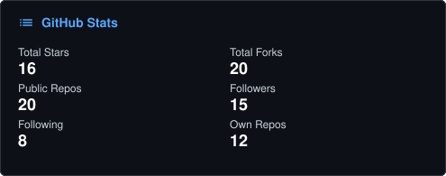
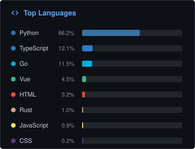
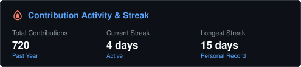
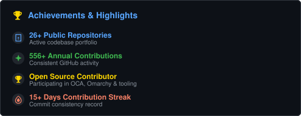

<h1 align="center">Hi, I am Oscar Madera 👋</h1>

Software developer specialized in modern web applications

  
  
  
  

---

### 🙋 About Me

Computer Science graduate from Universidad de Córdoba (Colombia). Full-stack developer focused on building robust, scalable web applications for clients and personal projects. I work primarily with the **JavaScript/TypeScript** ecosystem on the frontend and **Python** on the backend, with experience delivering complete solutions — from architecture design to production deployment.

I also build applied AI tools, integrating language models into real workflows (RAG, educational chatbots, document automation).

---

### 🔨 What I'm Working On

- **Freelance Development:** custom websites and web applications for clients, from landing pages to platforms with custom backends
- **EduRAG-Platform:** RAG-based educational platform allowing teachers to create chatbots trained on their own documents
- **AI Automation:** integrating tools like Claude Code to accelerate development, document processing, and workflows

---

### 🛠️ Tech Stack

**Frontend**

**Backend**

**Database & Infrastructure**

**AI / GenAI**

**Tools**

---

### 📊 GitHub Stats

  
  

  
  

---

### 📬 Contact

- ✉️ dario.oviedo2022@gmail.com
- 💼 [LinkedIn](https://www.linkedin.com/in/oscar-dario-madera-bolano-13279215a)

<em>Available for freelance web development projects</em>

